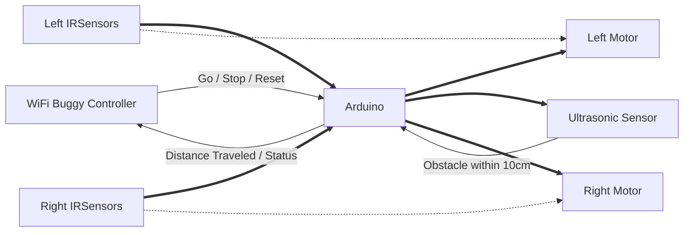
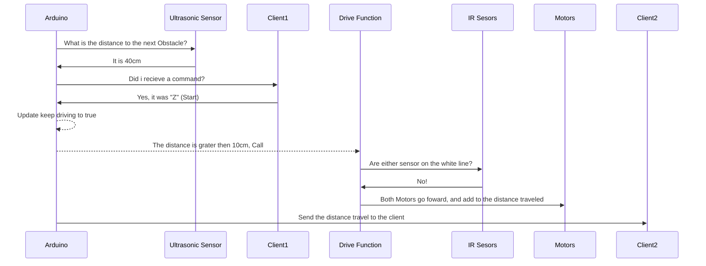
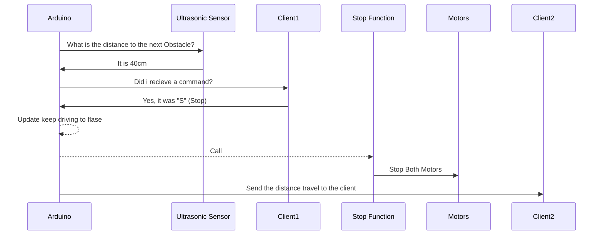
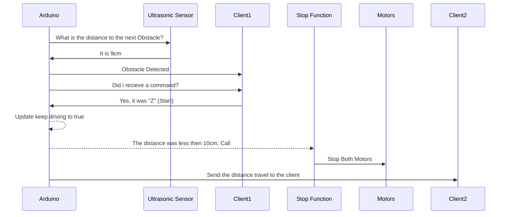
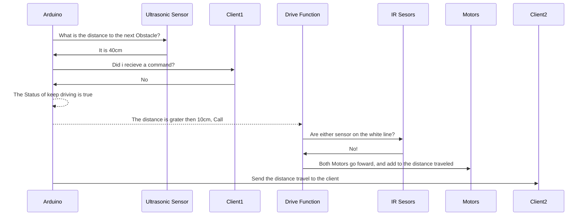
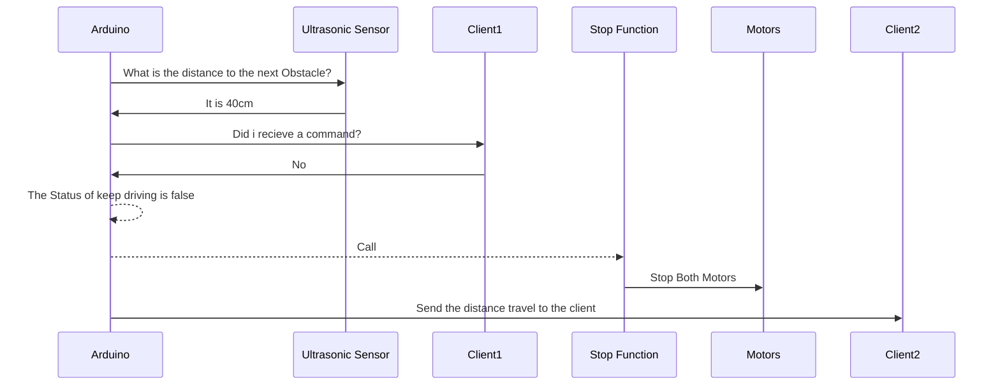
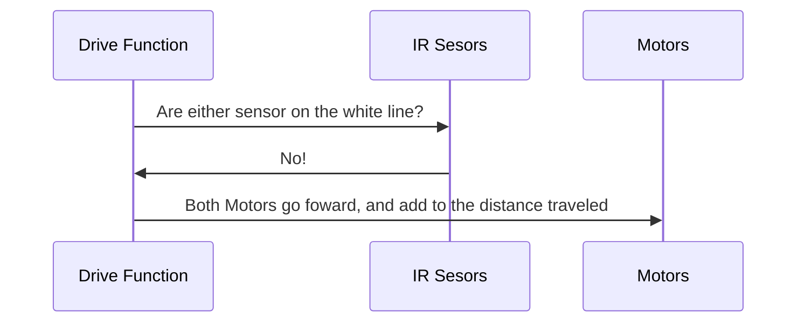
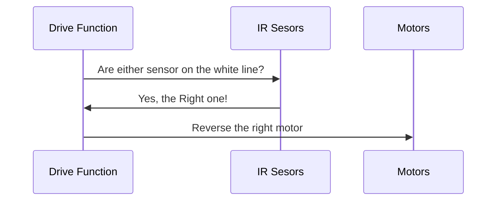

Start Command Sent

Stop Command Sent

Obstacle within 10cm

No Command Recieved but keep driving is true

No Command Recieved but keep driving is false

Drive Function Sequence sequenceDiagram

