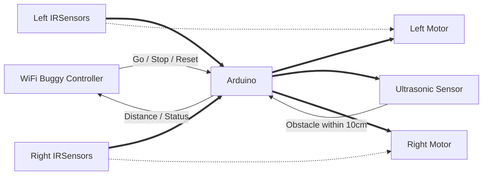

```mermaid
flowchart LR
  A[WiFi Buggy Controller] -- Go / Stop / Reset --> C[Arduino]
  C -- Distance / Status --> A

  C ==> D[Left Motor]
  E[Right IRSensors] ==> C
  G[Left IRSensors] ==> C
  C ==> F[Ultrasonic Sensor]
  C ==> B[Right Motor]

  F -- Obstacle within 10cm --> C
  E -.-> B
  G -.-> D
```
