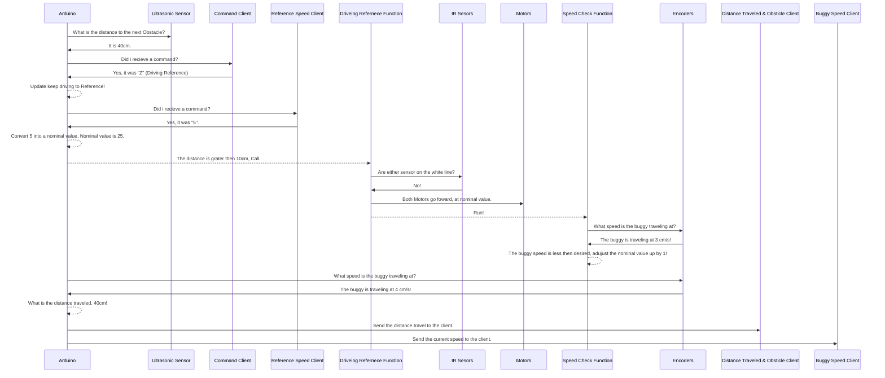
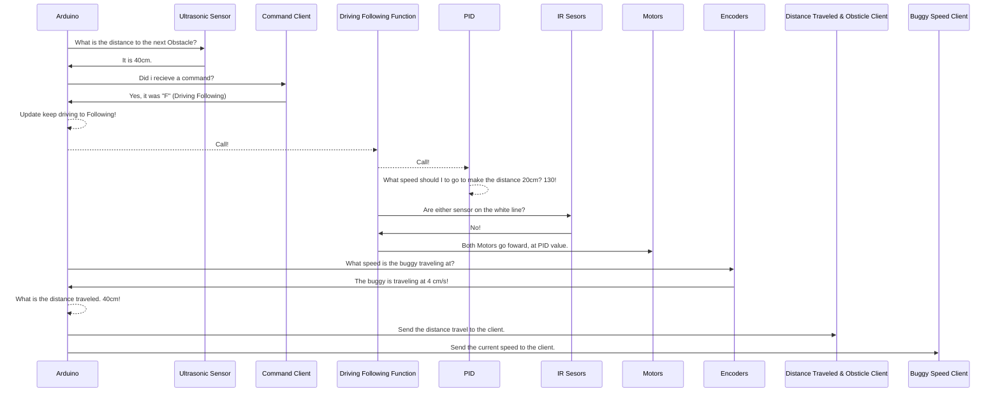
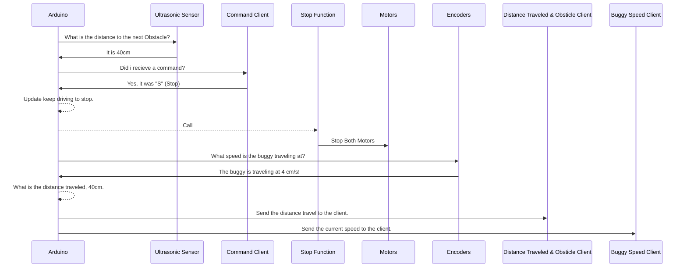
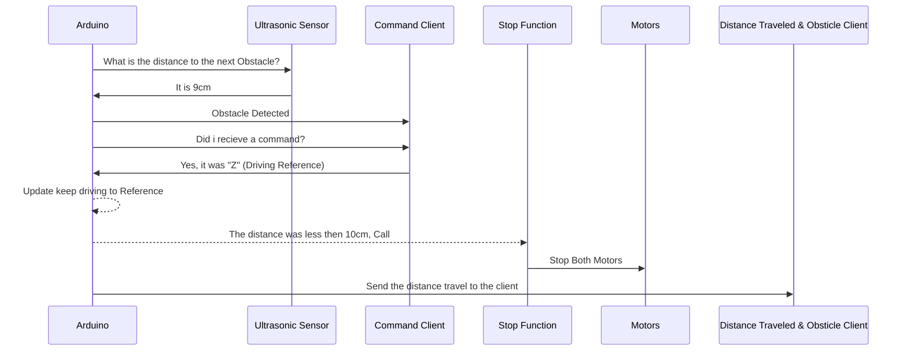
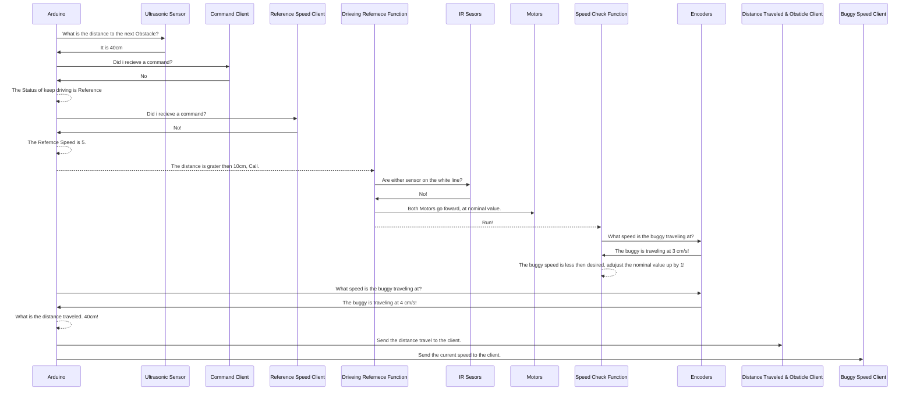

Reference Speed Command Received

```mermaid
sequenceDiagram
  Arduino ->> Ultrasonic Sensor: What is the distance to the next Obstacle?
  Ultrasonic Sensor ->> Arduino: It is 40cm.
  Arduino ->> Command Client: Did i recieve a command?
  Command Client ->> Arduino: Yes, it was "Z" (Driving Reference)
  Arduino -->> Arduino: Update keep driving to Reference!
  Arduino ->> Reference Speed Client: Did i recieve a command?
  Reference Speed Client ->> Arduino: Yes, it was "5".
  Arduino -->> Arduino: Convert 5 into a nominal value. Nominal value is 25.
  Arduino -->> Driveing Refernece Function: The distance is grater then 10cm, Call.
  Driveing Refernece Function ->> IR Sesors: Are either sensor on the white line?
  IR Sesors ->> Driveing Refernece Function: No!
  Driveing Refernece Function ->> Motors: Both Motors go foward, at nominal value.
  Driveing Refernece Function -->> Speed Check Function: Run!
  Speed Check Function ->> Encoders: What speed is the buggy traveling at?
  Encoders ->> Speed Check Function: The buggy is traveling at 3 cm/s!
  Speed Check Function -->> Speed Check Function: The buggy speed is less then desired, adujust the nominal value up by 1!
  Arduino ->> Encoders: What speed is the buggy traveling at?
  Encoders ->> Arduino: The buggy is traveling at 4 cm/s!
  Arduino -->> Arduino: What is the distance traveled. 40cm!
  Arduino ->> Distance Traveled & Obsticle Client: Send the distance travel to the client.
  Arduino ->> Buggy Speed Client: Send the current speed to the client.
```
Following Command Received

```mermaid
sequenceDiagram
  Arduino ->> Ultrasonic Sensor: What is the distance to the next Obstacle?
  Ultrasonic Sensor ->> Arduino: It is 40cm.
  Arduino ->> Command Client: Did i recieve a command?
  Command Client ->> Arduino: Yes, it was "F" (Driving Following)
  Arduino -->> Arduino: Update keep driving to Following!
  Arduino -->> Driving Following Function: Call!
  Driving Following Function -->> PID: Call!
  PID -->> PID: What speed should I to go to make the distance 20cm? 130!
  Driving Following Function ->> IR Sesors: Are either sensor on the white line?
  IR Sesors ->> Driving Following Function: No!
  Driving Following Function ->> Motors: Both Motors go foward, at PID value.
  Arduino ->> Encoders: What speed is the buggy traveling at?
  Encoders ->> Arduino: The buggy is traveling at 4 cm/s!
  Arduino -->> Arduino: What is the distance traveled. 40cm!
  Arduino ->> Distance Traveled & Obsticle Client: Send the distance travel to the client.
  Arduino ->> Buggy Speed Client: Send the current speed to the client.
```
Stop Command Received

```mermaid
sequenceDiagram
  Arduino ->> Ultrasonic Sensor: What is the distance to the next Obstacle?
  Ultrasonic Sensor ->> Arduino: It is 40cm 
  Arduino ->> Command Client: Did i recieve a command?
  Command Client ->> Arduino: Yes, it was "S" (Stop)
  Arduino -->> Arduino: Update keep driving to stop.
  Arduino -->> Stop Function: Call
  Stop Function ->> Motors: Stop Both Motors
  Arduino ->> Encoders: What speed is the buggy traveling at?
  Encoders ->> Arduino: The buggy is traveling at 4 cm/s!
  Arduino -->> Arduino: What is the distance traveled, 40cm.
  Arduino ->> Distance Traveled & Obsticle Client: Send the distance travel to the client.
  Arduino ->> Buggy Speed Client: Send the current speed to the client.
```
Obstacle within 10cm

```mermaid
sequenceDiagram
  Arduino ->> Ultrasonic Sensor: What is the distance to the next Obstacle?
  Ultrasonic Sensor ->> Arduino: It is 9cm 
  Arduino ->> Command Client: Obstacle Detected
  Arduino ->> Command Client: Did i recieve a command?
  Command Client ->> Arduino: Yes, it was "Z" (Driving Reference)
  Arduino -->> Arduino: Update keep driving to Reference
  Arduino -->> Stop Function: The distance was less then 10cm, Call
  Stop Function ->> Motors: Stop Both Motors
  Arduino ->> Distance Traveled & Obsticle Client: Send the distance travel to the client
```
No Command Recieved but keep driving is Reference

```mermaid
sequenceDiagram
  Arduino ->> Ultrasonic Sensor: What is the distance to the next Obstacle?
  Ultrasonic Sensor ->> Arduino: It is 40cm 
  Arduino ->> Command Client: Did i recieve a command?
  Command Client ->> Arduino: No
  Arduino -->> Arduino: The Status of keep driving is Reference

  Arduino ->> Reference Speed Client: Did i recieve a command?
  Reference Speed Client ->> Arduino: No!
  Arduino -->> Arduino: The Refernce Speed is 5.
  Arduino -->> Driveing Refernece Function: The distance is grater then 10cm, Call.
  Driveing Refernece Function ->> IR Sesors: Are either sensor on the white line?
  IR Sesors ->> Driveing Refernece Function: No!
  Driveing Refernece Function ->> Motors: Both Motors go foward, at nominal value.
  Driveing Refernece Function -->> Speed Check Function: Run!
  Speed Check Function ->> Encoders: What speed is the buggy traveling at?
  Encoders ->> Speed Check Function: The buggy is traveling at 3 cm/s!
  Speed Check Function -->> Speed Check Function: The buggy speed is less then desired, adujust the nominal value up by 1!
  Arduino ->> Encoders: What speed is the buggy traveling at?
  Encoders ->> Arduino: The buggy is traveling at 4 cm/s!
  Arduino -->> Arduino: What is the distance traveled. 40cm!
  Arduino ->> Distance Traveled & Obsticle Client: Send the distance travel to the client.
  Arduino ->> Buggy Speed Client: Send the current speed to the client.
```
